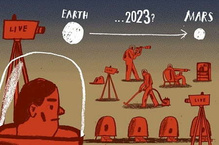
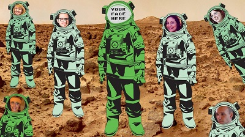
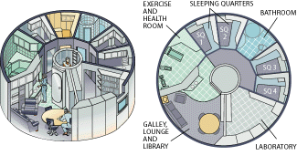
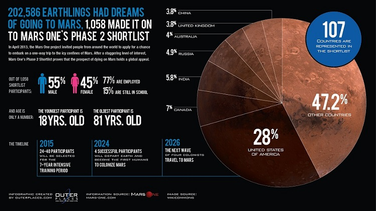

# Introduction

The Mars Simulation Project (mars-sim) is an open source project thatvsimulates mission planning, operations and activities of initial settlers on Mars with highcomputer modeling details.

Have you ever been fascinated by reality TV shows in which how contestants face tensions and survive tests? Teamwork is put to test. Loners come out of their own social isolation to collaborate with others to accomplish mutual goals. Driven leaders struggle in decision-making but exercise enough self-restrain to avoid pitting against others having better solutions to resolve a challenge.

				
							
What mars-sim attempts to model is how early settlers work together to sustain their base. 
While high-level strategic and mission planning is essential, daily operation of a base falls 
on how well each individual behaves and relates to one another. Good teamwork and maintaining 
relationship with one another is crucial. mars-sim endows each settler with personalities, 
natural attributes and job skills, and preferences (likes-and-dislikes on a bunch of tasks), 
as there are tasks to get done in developing and sustaining the settlement. mars-sim defines an 
assigned role and a job position for each settler with a myriad of tasks to perform. While most
tasks are carried out independently by individuals, some require teaming up with others to get
done.	

With private ventures such as SpaceX offering new vision of going to Mars and the Mars One 
Foundation seeking to recruit future settlers on a one-way ticket to Mars, mars-sim is giving 
the audience a preview of the coming attractions in unraveling the intricate innerworking of 
establishing a human foothold on Mars.
				
				

The good news is that, unlike in a TV soap opera in that the relationship dynamics of the characters are scripted to appeal to a qualified audience, actions and reactions of each settler in mars-sim are emergent. They interact with one anotherunder certain mission requirements and environmental stressors as the settlement is being developed. Their personality and natural attributes can positively or negatively affect social networking. Just like in real life, the bond between any two individuals gets strengthened with positive feedback and worsen with negative exchange, or degraded over time when less contact is made.
				

						
Below are the typical concerns you may have to work out if you were a mission planner for a human-rated Mars mission: 

1. What types of psychological profile of a team should I select for each mission going to Mars to jump-start a colony vs. sustain the settlement? 
1. How many of them should I send on each mission, accompanied with what resources, parts, equipment, vehicles, and building modules? 
1. How often should I send these resupply missions to seed each existing settlement or to start a new outpost nearby? 
1. What interventions do I need to do to ensure these settlers balance between their own personal needs and the collective needs?
									
In mars-sim, you will have an opportunity to flesh out your own ideas and test your hypotheses in how a settlement should be run and how mission planning be done.

				
